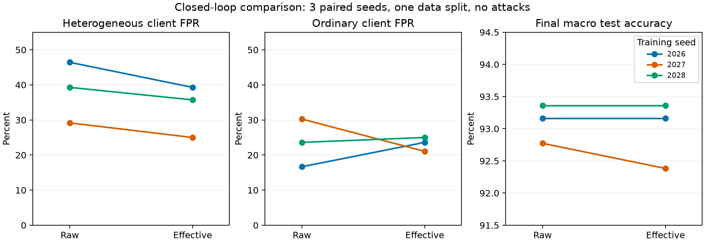

# 首批无攻击配对实验结果（2026-10-04）

6 次预先指定的实验全部完成，每次 10 轮。有效更新表示在三个训练种子上均降低正常异质客户端的误判率，种子均值从 **38.29% 降至 33.33%**；配对差值为 **−4.96 ± 1.91 个百分点**。但剩余误判仍较高，贡献权重与最终准确率没有一致改善。因此，本批支持把“表示方式与异质性误判”作为继续研究的问题，不能把换用有效更新表示视为完整解决方案，也不能宣称防御能力得到证明。

## 实验设置与核验

- Qwen2.5-0.5B，LoRA rank 4 / alpha 8，q_proj、v_proj，BF16，长度 256。
- 20 个客户端，5 个正常异质客户端；每轮抽取 10 个，训练 10 轮。每客户端 500 条样本，普通客户端使用 SST-2，异质客户端混合 40% IMDB。每轮本地 1 epoch、学习率 2e-4，无步数截断。
- 两组均为固定 beta=0.2 的独立 H-FedSA 迁移实现，使用相同有效更新聚合。唯一配置差异为检测表示 raw / effective；这不是包含原论文 DDPG 的完整复现。
- 训练种子 2026/2027/2028，共用数据种子 42 和同一个划分。可信参考只使用 SST-2 root 128 条；每域最终测试 256 条。模型和数据版本见配置及数据清单。
- 所有配置摘要、源码摘要、模型版本、数据摘要核验通过；每个配对的 10 轮参与列表一致，第一轮基础、参考及所有客户端适配器张量逐元素一致。见 [paired_checks.json](paired_checks.json)。
- 60 份缓存更新各重放 raw/effective 两种评分。自身表示的重放全部复现原始恶意标记，权重差小于 1e-8。无缺失轮次、无防御回退、无选择或丢弃种子。先行一轮测量计入 seed 2026 raw 的 10 轮。

## 闭环训练结果

下表为三个训练种子的均值 ± 样本标准差。每个种子的误判率先汇总其 10 轮；重复出现的客户端轮次不是独立实验样本。权重比定义为异质客户端的平均聚合权重除以普通客户端的平均聚合权重。

| 指标 | raw | effective |
|---|---:|---:|
| 正常异质客户端误判率 | 38.29 ± 8.67% | 33.33 ± 7.43% |
| 普通客户端误判率 | 23.51 ± 6.80% | 23.22 ± 2.00% |
| 异质/普通平均权重比 | 0.72 ± 0.24 | 0.73 ± 0.18 |
| 最终宏平均准确率 | 93.10 ± 0.30% | 92.97 ± 0.52% |

| 训练种子 | raw 异质误判 | effective 异质误判 | 差值（百分点） | raw / effective 宏准确率 |
|---|---:|---:|---:|---:|
| 2026 | 13/28 (46.43%) | 11/28 (39.29%) | -7.14 | 93.16% / 93.16% |
| 2027 | 7/24 (29.17%) | 6/24 (25.00%) | -4.17 | 92.77% / 92.38% |
| 2028 | 11/28 (39.29%) | 10/28 (35.71%) | -3.57 | 93.36% / 93.36% |



异质客户端累计误判为 raw 31/80、effective 27/80，普通客户端为 52/220、51/220；这些合并计数仅用于描述。宏准确率配对变化为 −0.13 ± 0.23 个百分点；不能把这解释为已证明两组等效。异质/普通权重比的配对变化为 +0.009 ± 0.115，seed 2027、2028 的权重比反而下降。有效表示降低硬标记误判，并不保证恢复聚合贡献。

## 同一更新上的离线评分重放

以下每一行的两种评分使用完全相同的已保存更新、参考和随机种子，更新来源轨迹保持固定。它衡量评分差异，不会生成新训练轨迹、测试准确率或攻击成功率。

| 更新来源轨迹 | 种子 | raw 重放异质误判率 | effective 重放异质误判率 | 差值（百分点） |
|---|---|---:|---:|---:|
| raw | 2026 | 46.43% | 28.57% | -17.86 |
| raw | 2027 | 29.17% | 29.17% | +0.00 |
| raw | 2028 | 39.29% | 35.71% | -3.57 |
| effective | 2026 | 39.29% | 39.29% | +0.00 |
| effective | 2027 | 37.50% | 25.00% | -12.50 |
| effective | 2028 | 39.29% | 35.71% | -3.57 |

raw 来源轨迹上的配对差值均值为 -7.14 ± 9.45 个百分点；effective 来源轨迹上为 -5.36 ± 6.44 个百分点。两类来源分别报告，不能合并当成 6 个独立训练种子。部分种子在某个来源轨迹上没有变化，提示评分收益依赖更新状态；闭环结果还包含聚合影响后续更新的反馈。

## 运行开销与数值范围

六次训练的逐轮耗时合计 2.285 小时（不含数据准备、最终评价等，因此不是账单时长）；峰值已分配 GPU 显存约 2.714 GiB。60 轮固定秩聚合的相对 SVD 投影误差平均 0.007502，范围 0.006215–0.009164。这些是描述性运行记录，不是受控性能基准。

## 结论边界与下一步

只有 3 个训练种子、一个数据划分、一个小模型及一种混合比例；没有恶意客户端，不能评价攻击召回、AUC 或 ASR，更不能宣称安全防御有效。GMM 分量责任度也不等同于校准后的安全概率。当前差异较小，不作统计显著性或广泛泛化主张。

下一阶段应先明确误判是否主要来自参考域偏置、强制三簇语义映射及硬阈值，再设计受控消融：参考域匹配必须给比较组相同参考数据预算；变化因素分开，保留普通与异质客户端误判、贡献权重、任务效用三类指标。之后再加入独立攻击评估和更多数据划分。上述为后续研究建议，本次没有启动新的训练。

## 归档与复现

- 冻结训练提交：`df7e8c2095fd7c1fc89f869d39059676eb622812`；源码摘要：`21b22af56c6efdce74a615ddbd7ca7a4f7f984708aa2dec38f624e38209958ca`。
- [预先固定的配置](../../configs/planned/clean-pair/manifest.json)、[实验协议](../../docs/clean_pair_protocol.md)、[逐种子指标](per_seed.csv)、[逐轮原始记录](records)、[重放明细](replay_clients.csv) 均已保存。
- [实际数据子集](dataset/bundle.json) 和 [完整清单](dataset/manifest.json) 包含本次使用的 10,896 条样本、来源行号、文本摘要和划分，数据摘要为 `bd210edce75e25bd00a1685afbd501b3fdfea8ca176b94fc58981c6f6745276e`。其中 IMDb root 的 128 条已预留但本批未用于训练参考。原始来源为 [SST-2](https://huggingface.co/datasets/stanfordnlp/sst2) 和 [IMDB](https://huggingface.co/datasets/stanfordnlp/imdb)；来源与版本保留在清单中。
- [分析脚本](../../scripts/analyze_clean_pair.py) 对完整运行目录执行配对核验及离线重放；[报告脚本](../../scripts/report_clean_pair.py) 生成本报告和图。分析运行成功后再生成报告，不使用测试结果选择参数。
- 完整本地压缩备份另含六组适配器、检查点、60 份更新缓存、tokenizer、数据子集、配置、日志与冻结源码。GitHub 保存可审阅的代码、配置、数据和结果；二进制检查点及更新缓存保存在完整备份中。恢复时在独立目录解压，使用冻结源码和保存的环境依赖；基础模型按固定版本获取，不包含在备份中。
- 完整备份内的 `BACKUP_MANIFEST.json` 记录逐文件 SHA-256，压缩包旁的 `.sha256` 记录整个归档摘要。`backup_verification.json` 另记录本地校验结果，避免压缩包自引用。

```bash
# 在恢复后的 Mars 目录中，使用当时的运行依赖
python scripts/analyze_clean_pair.py
python scripts/report_clean_pair.py
```
